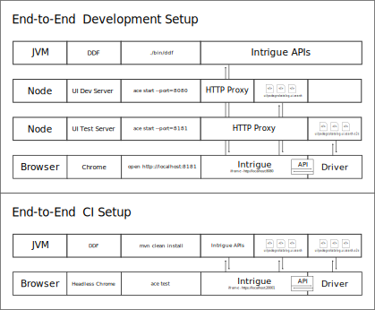

# catalog-ui-search-e2e

Implements a series of user level e2e tests through Intrigue's programmatic
API.

NOTE: The following commands depend on having a UI dev server running on
port 8080.

## e2e dev server

To interact with the Intrigue programmatic API, do:

    yarn start

You should be able to interact with the API via a simple UI which updates
based on application state.

### exploratory testing

The purpose of exploratory testing is to exercise the UI in a variety of
scenarios without having to explicitly write tests. This can be useful to
find ways to break the UI in unexpected ways. The quality of tests will
heavily depend on the quality of Intrigue's programmatic API so care
should be taken in designing an API that reflects realistic user
interaction. If a series of actions is determined to cause issues, those
actions should be recorded and run regularly as a pre-scripted test.
Moreover, the addition of an action has the ability to grow the search
space exponentially.

To start exploratory testing, append the `?explore` query parameter to the
e2e dev server url in the browser.

## e2e test server

To run and debug pre-scripted tests in a browser, do:

    yarn start:test

## overall flow

The diagram below is for getting a better understanding of all the pieces
that come together to enable e2e testing. You are not expected to run any
of the commands below, they are used to expose the underlying plumbing.

